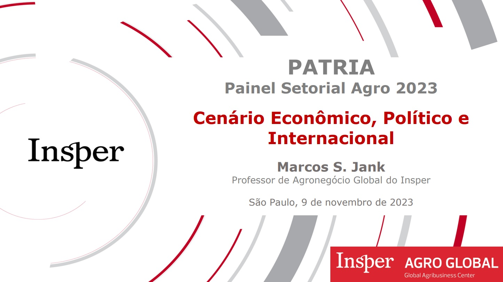
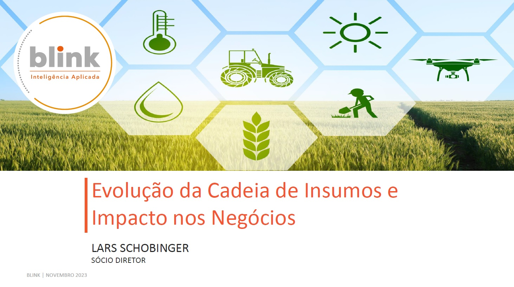
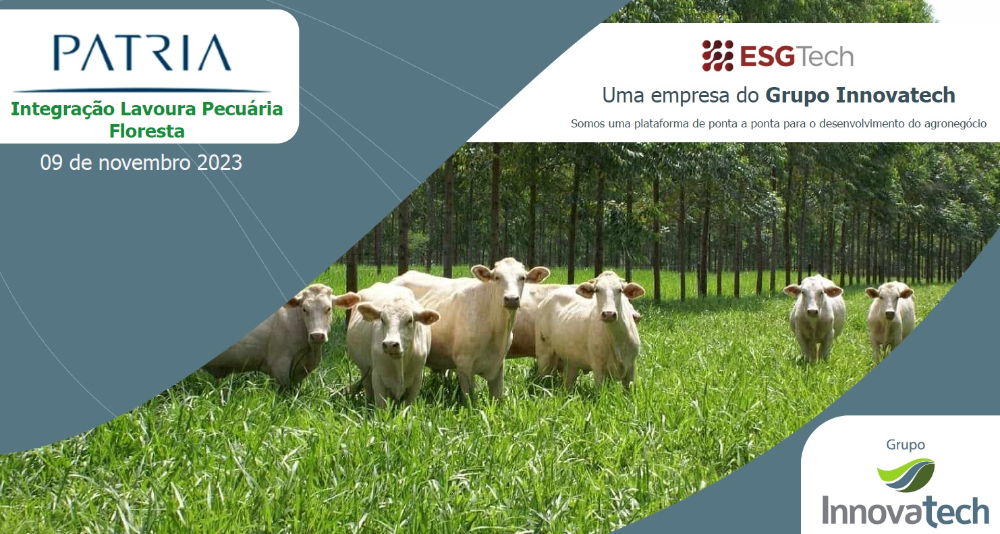

# Painel Setorial Agro

## Projeções macroeconômicas, dinâmica global do agronegócio e seus impactos e oportunidades para a agricultura e pecuária no Brasil

 
 

## Evolução na cadeia de insumos e seus impactos para o agronegócio brasileiro

 
 

## Integração Lavoura Pecuária e Floresta (ILPF), uma grande oportunidade para o agro brasileiro

 
 

## Novos avanços de tecnologia para a agricultura e pecuária brasileira e Plano Safra 2023/2024

